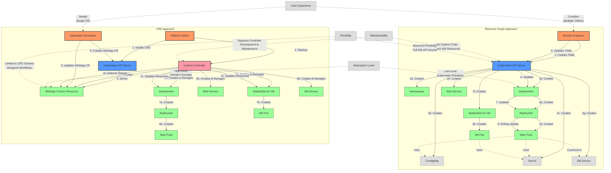

```mermaid

flowchart TD
    classDef userAction fill:#f96,stroke:#333,stroke-width:2px
    classDef k8sComponent fill:#59f,stroke:#333,stroke-width:2px
    classDef resource fill:#9f9,stroke:#333,stroke-width:1px
    classDef controller fill:#f9a,stroke:#333,stroke-width:2px
    classDef relationship fill:#ddd,stroke:#333,stroke-width:1px,stroke-dasharray: 5 5
    
    %% Standard Kubernetes Resource Graph Approach
    subgraph "Resource Graph Approach"
        User1[DevOps Engineer]:::userAction
        User1 -->|1. Creates YAML| K8sAPI1[Kubernetes API Server]:::k8sComponent
        
        K8sAPI1 -->|2a. Creates| NS1[Namespace]:::resource
        K8sAPI1 -->|2b. Creates| ConfigMap1[ConfigMap]:::resource
        K8sAPI1 -->|2c. Creates| Secret1[Secret]:::resource
        K8sAPI1 -->|2d. Creates| Deployment1[Deployment]:::resource
        K8sAPI1 -->|2e. Creates| WebService1[Web Service]:::resource
        K8sAPI1 -->|2f. Creates| StatefulSet1[StatefulSet for DB]:::resource
        K8sAPI1 -->|2g. Creates| DBService1[DB Service]:::resource
        
        Deployment1 -->|3a. Creates| ReplicaSet1[ReplicaSet]:::resource
        ReplicaSet1 -->|4a. Creates| WebPods1[Web Pods]:::resource
        StatefulSet1 -->|3b. Creates| DBPod1[DB Pod]:::resource
        
        WebPods1 -.->|Uses| ConfigMap1:::relationship
        WebPods1 -.->|Uses| Secret1:::relationship
        WebPods1 -.->|Connects to| DBService1:::relationship
        DBPod1 -.->|Uses| Secret1:::relationship
        
        %% Update flow
        User1 -->|5. Updates YAML| K8sAPI1
        K8sAPI1 -->|6. Updates| Deployment1
        Deployment1 -->|7. Updates| ReplicaSet1
        ReplicaSet1 -->|8. Rolling Update| WebPods1
    end
    
    %% CRD Approach
    subgraph "CRD Approach"
        User2[Application Developer]:::userAction
        Admin[Platform Admin]:::userAction
        
        Admin -->|1. Installs CRD| K8sAPI2[Kubernetes API Server]:::k8sComponent
        Admin -->|2. Deploys| Controller[Custom Controller]:::controller
        
        User2 -->|3. Creates WebApp CR| K8sAPI2
        K8sAPI2 -->|4. Stores| WebAppCR[WebApp Custom Resource]:::resource
        
        Controller -->|5. Watches| WebAppCR
        Controller -->|6a. Creates & Manages| Deployment2[Deployment]:::resource
        Controller -->|6b. Creates & Manages| WebService2[Web Service]:::resource
        Controller -->|6c. Creates & Manages| StatefulSet2[StatefulSet for DB]:::resource
        Controller -->|6d. Creates & Manages| DBService2[DB Service]:::resource
        
        Deployment2 -->|7a. Creates| ReplicaSet2[ReplicaSet]:::resource
        ReplicaSet2 -->|8a. Creates| WebPods2[Web Pods]:::resource
        StatefulSet2 -->|7b. Creates| DBPod2[DB Pod]:::resource
        
        %% Update flow
        User2 -->|9. Updates WebApp CR| WebAppCR
        Controller -->|10. Detects Change| WebAppCR
        Controller -->|11. Updates Resources| Deployment2
        Controller -->|11. Updates Resources| StatefulSet2
    end
    
    %% Comparison Callouts
    UserExperience[User Experience]:::relationship
    Maintainability[Maintainability]:::relationship
    Abstraction[Abstraction Level]:::relationship
    Flexibility[Flexibility]:::relationship
    
    UserExperience -.->|"Complex<br>(Multiple YAMLs)"| User1
    UserExperience -.->|"Simple<br>(Single CR)"| User2
    
    Maintainability -.->|"No Custom Code<br>Direct K8s Resources"| K8sAPI1
    Maintainability -.->|"Requires Controller<br>Development & Maintenance"| Controller
    
    Abstraction -.->|"Low-Level<br>Kubernetes Primitives"| Deployment1
    Abstraction -.->|"High-Level<br>Domain Concepts"| WebAppCR
    
    Flexibility -.->|"Maximum Flexibility<br>Full K8s API Access"| K8sAPI1
    Flexibility -.->|"Limited to CRD Schema<br>Designed Workflows"| WebAppCR

```
